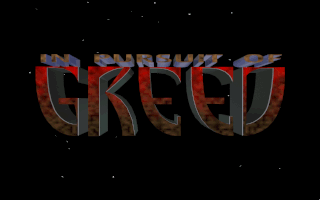

# GZGreed
A port of In Pursuit of Greed to the GZDoom engine.

Project is in progress but is not yet playable.

In 2014 Robert Morgan released the source code for this game as freeware with the conditions:
"These sources are provided for educational and historical purposes. No assets or code may be used in any way commercially. Personal and educational use only."

As such this port should not be sold or used in any commercial capacity at all.
It is my belief that this port therefore stays safely in the category of "personal and educational use" given that it is just a little hobby project I'm doing for fun and as a learning project for myself.
